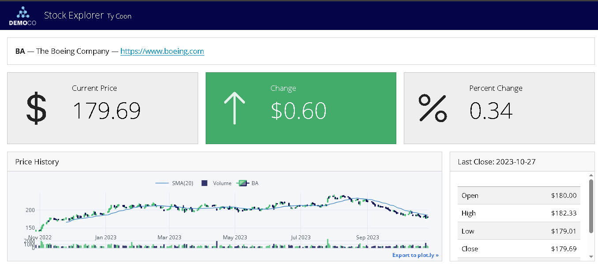

# **Prueba Técnica - Analítico/a de Ecosistemas**
## Prueba Analítica: Modelo Opciones de Pago
### Científico de Datos:

* Daniel Felipe Pérez Grajales . dfperezg@unal.edu.co 

  

En el siguiente repositorio se pondrá a disposición el desarrollo de la prueba técnica para el puesto de Analítico/a de Ecosistemas en Bancolombia

**Objetivo**

Desarrollar una solución analítica E2E que permita poner en producción un modelo que genere un indicador de propensión a la aceptación de opción de pago de cada obligación de un cliente en mora.

### Archivos solución prueba:

1. **Prueba_Tecnica_BC_DsC_DFPG.ipynb** : jupyter notebook con el desarrollo de la construcción(ETL) y modelado 

2. **Solucion_desarrollo_prueba_DFPG.docx** : Documentación solución del problema  

3. **Resultados/resultado_prueba.csv** : Resultado predicción del modelo seleccionado fuera de muestra  

4. **Pesos_modelo\AutoML_Model_pob_ob_pg.pkl** :  Pipeline con el modelo seleccionado, pesos del modelo 

5. **presentación: pendiente a la reunión** 

6. **diseña un sistema de manera teórica que bosqueje una solución que permita hacer disponibles los resultados de tu modelo analítico, y que sean fácilmente consumibles por servicios externos, como páginas web, servicio móvil, etc:**   

Para este caso se propone como solución de darle un from al seguimiento del modelo y la construccion del Kpi's

